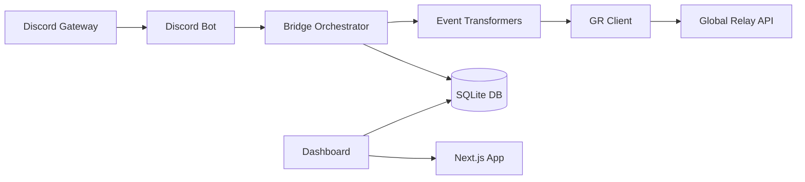

# Discord → Global Relay Bridge

A service that captures Discord messages in real-time and archives them to Global Relay's Conversation Archiving API for compliance and record-keeping.

## Architecture



### Packages

| Package | Description |
|---------|-------------|
| `packages/core` | Shared types, config, and event transformers |
| `packages/gr-client` | Global Relay API client with OAuth2 |
| `packages/discord-bot` | Discord Gateway event handlers |
| `packages/bridge` | Orchestrator: queue, router, indexer |
| `packages/dashboard` | Next.js web dashboard |

## Prerequisites

- Node.js 18+
- npm 9+
- A Discord Bot Token and Application ID
- Global Relay API credentials (Client ID + Client Secret)

## Setup

### 1. Clone and Install

```bash
git clone <repo-url>
cd DiscordToGlobalRelay
npm install
```

### 2. Configure Environment

Copy `.env.example` to `.env` and fill in your credentials:

```env
# Discord
DISCORD_TOKEN=your_bot_token
DISCORD_CLIENT_ID=your_application_id
DISCORD_CLIENT_SECRET=your_oauth_secret

# Global Relay
GR_CLIENT_ID=your_gr_client_id
GR_CLIENT_SECRET=your_gr_client_secret
GR_OAUTH_URL=https://iam-oauth2.globalrelay.com/oauth2/token
GR_API_BASE_URL=https://conversations.api.globalrelay.com/v2

# Dashboard Auth
NEXTAUTH_SECRET=generate_a_random_secret
NEXTAUTH_URL=http://localhost:3000
DISCORD_ADMIN_GUILD_ID=your_server_id
```

### 3. Initialize Database

```bash
npx prisma generate
npx prisma db push
npx ts-node prisma/seed.ts
```

### 4. Run the Bridge

```bash
npm run dev -w packages/bridge
```

### 5. Run the Dashboard

```bash
npm run dev -w packages/dashboard
```

Visit `http://localhost:3000` and log in with Discord OAuth.

## Usage

### Deploy Slash Commands

```bash
npx ts-node packages/discord-bot/src/deploy-commands.ts
```

### Monitor Archive Logs

Check the Dashboard > Logs page or query the SQLite DB directly:

```bash
npx prisma studio
```

## Testing

```bash
# Run all tests
npx vitest run

# Run specific package tests
npx vitest run packages/bridge
npx vitest run packages/gr-client
npx vitest run packages/core
```

## Project Structure

```
DiscordToGlobalRelay/
├── packages/
│   ├── core/           # Types, config, transformers
│   │   └── src/
│   │       ├── types.ts
│   │       ├── config.ts
│   │       └── transformers/
│   ├── gr-client/      # Global Relay API client
│   │   └── src/
│   │       ├── auth.ts
│   │       └── client.ts
│   ├── discord-bot/    # Discord event handlers
│   │   └── src/
│   │       └── handlers/
│   ├── bridge/         # Orchestration layer
│   │   └── src/
│   │       ├── router.ts
│   │       ├── queue.ts
│   │       ├── indexer.ts
│   │       └── index.ts
│   └── dashboard/      # Web management UI
│       └── src/
│           ├── app/
│           │   ├── api/
│           │   └── dashboard/
│           └── components/
├── prisma/
│   ├── schema.prisma
│   └── seed.ts
└── tests/
    └── e2e/
        └── smoke.test.ts
```

## License

MIT
