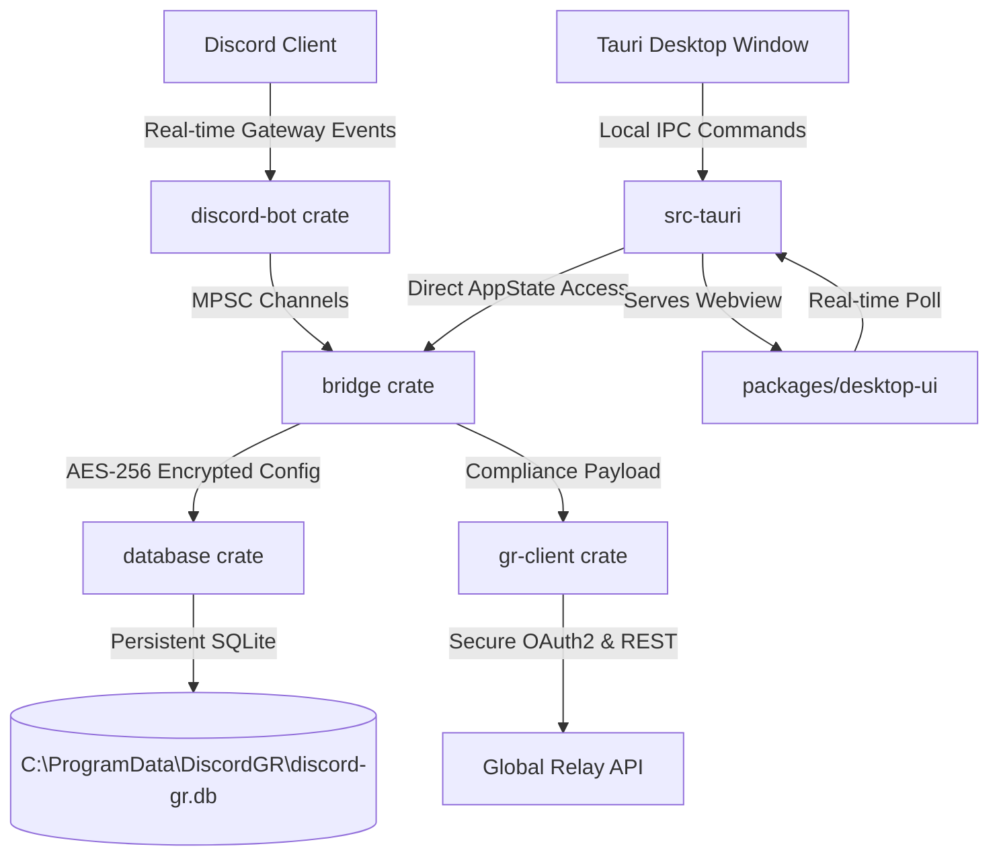

# 🛡️ RelayBridge

An enterprise-grade, high-performance, real-time message archival bridge from **Discord** to **Global Relay's Conversation Archiving API**. Built with **Rust**, **Tauri**, and **React** to guarantee optimal memory safety, security, and a beautiful native Windows desktop experience.

---

## 🏛️ Architecture

RelayBridge is structured as a high-fidelity, multi-tiered Rust Cargo workspace coupled with a modular React frontend served securely by Tauri:



### 🗂️ Core Components & Crates

| Component / Crate | Type | Description |
|---|---|---|
| **`src-tauri`** | Rust Application | Tauri v2 configuration, window controls, centered custom splash screen loader, and a fully programmatic context system tray (Left-Click to restore, Right-Click menu options: *Open UI*, *Show Status*, *Exit*). |
| **`packages/desktop-ui`** | React + Vite UI | A high-fidelity, dark-themed dashboard built with standard vanilla CSS and Lucide icons. Includes interactive analytics charts, step-by-step connection wizard, and live status dots. |
| **`crates/bridge-core`** | Rust Library | Houses the core shared domain types, app configurations, and machine-wide AES-256 encryption/decryption keys. |
| **`crates/bridge`** | Rust Library | The system orchestrator. Coordinates thread-safe start/stop commands, queues messages, routes events, and logs connection health status in real-time. |
| **`crates/database`** | Rust Library | Thread-safe SQLite connector backed by a database connection pool. Features compile-time embedded SQLx schema migrations to ensure 100% database schema consistency. |
| **`crates/discord-bot`** | Rust Library | Serenity-based Discord Gateway client that handles text channels, guild metadata, message creation/deletion events, and reaction captures. Configured with Schannel TLS for native Windows root certificate support. |
| **`crates/gr-client`** | Rust Library | Global Relay API client supporting JWT client-credentials OAuth token rotation, automated retry-on-rate-limit (429), and robust payload delivery. |

---

## 🔒 Security & Self-Healing Architecture

RelayBridge is built for critical corporate environments where data integrity and security are absolute requirements:

*   **Machine-Wide Database & Keys**: To ensure seamless interoperability between the Tauri user GUI and the background Windows Service (running as `LocalSystem`), all state is stored machine-wide under:
    *   **Database**: `C:\ProgramData\DiscordGR\discord-gr.db`
    *   **Master Key**: `C:\ProgramData\DiscordGR\master.key`
*   **AES-256 Encryption**: Every sensitive credential (Discord Bot Token, Discord Client Secret, Global Relay Client ID, Global Relay Client Secret) is encrypted at rest using high-entropy AES-256-GCM keys.
*   **Self-Healing Design**: If the `C:\ProgramData\DiscordGR` folder is ever deleted, the application will automatically recreate the folders, generate a fresh cryptographically secure random master key via the OS entropy pool (`rand::rngs::OsRng`), spin up the SQLite database file, and run all schema migrations to return the app to a pristine, operational state automatically.

---

## 🛠️ Prerequisites

*   **Rust**: Stable toolchain (Rust 1.75+) with `cargo` installed.
*   **Node.js**: Node 18+ and `npm`.
*   **WiX Toolset v3**: Required on Windows to bundle and compile the `.msi` production installer.

---

## 🚀 Setup & Local Development

### 1. Clone and Install Dependencies

```bash
git clone https://github.com/4syedalihassan/RelayBridge.git
cd RelayBridge
npm install
```

### 2. Configure Environment

Copy `.env.example` to `.env` and fill in your developer keys (used for mock server tests and local development):

```env
DISCORD_TOKEN=your_bot_token
DISCORD_CLIENT_ID=your_application_id
DISCORD_CLIENT_SECRET=your_oauth_secret

GR_CLIENT_ID=your_gr_client_id
GR_CLIENT_SECRET=your_gr_client_secret
GR_OAUTH_URL=https://iam-oauth2.globalrelay.com/oauth2/token
GR_API_BASE_URL=https://conversations.api.globalrelay.com/v2
```

### 3. Run in Development Mode

To start the local React development server and launch the Tauri desktop app in debug mode with hot-reload enabled:

```powershell
.\dev.bat
```

---

## 📦 Production Release Build

To compile a highly optimized, fully styled standalone installer bundle for Windows:

```powershell
.\build.bat
```

This script:
1. Sets the compiler PATH dynamically to locate your Rust toolchain.
2. Compiles the minified React production assets.
3. Compiles the optimized release version of the Rust workspace.
4. Invokes the WiX Toolset to link and package the final installer at:
   `target/release/bundle/msi/RelayBridge_0.1.0_x64_en-US.msi`

---

## 🧪 Testing

RelayBridge features a comprehensive suite of unit and integration tests.

To run the full suite:
```bash
cargo test --workspace
```

To run individual crate tests (e.g. database transactions or client encryption):
```bash
cargo test -p database
cargo test -p gr-client
```

---

## 📄 License

This project is licensed under the MIT License - see the LICENSE file for details.
